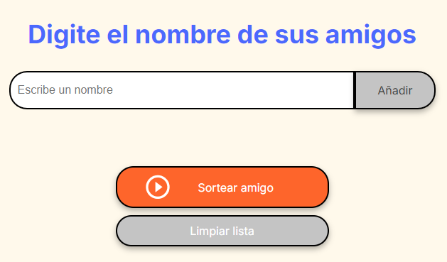
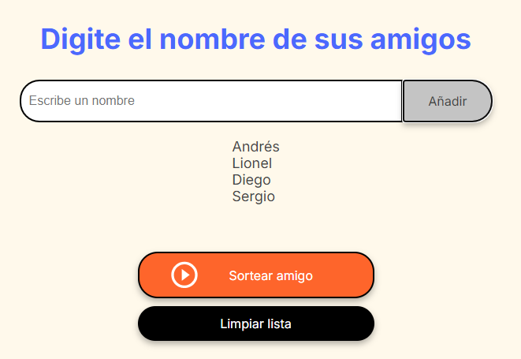
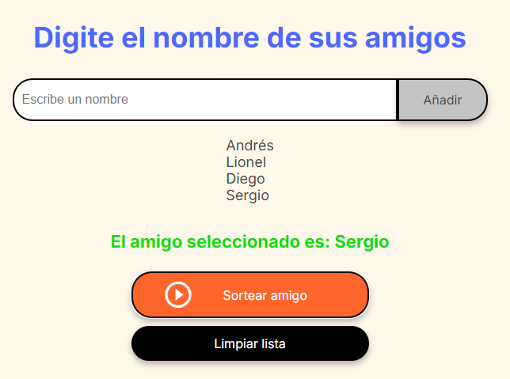

# 🎁 Proyecto "Amigo Secreto"

Este proyecto forma parte del primer challenge de **Oracle Next Education - Alura Latam**. La aplicación permite a los usuarios ingresar una lista de nombres para luego realizar un sorteo aleatorio y determinar quién será el **"Amigo Secreto"**.

## 🧠 ¿En qué consiste?

Es una aplicación sencilla, en la cual los usuarios pueden:

- Agregar nombres a una lista.
- Visualizar la lista completa de participantes.
- Realizar un sorteo aleatorio para elegir al Amigo Secreto.

## 🚀 Funcionalidades

### ✅ Agregar nombres
Los usuarios pueden escribir el nombre de un amigo en un campo de texto y hacer clic en el botón **"Añadir"**. El nombre se agrega a la lista de participantes que se muestra debajo.

### ❌ Validar entrada  
Si el campo está vacío o contiene caracteres no alfabéticos (como números o símbolos), se mostrará una alerta solicitando un nombre válido. Solo se permiten letras.

### 📃 Visualizar la lista
Todos los nombres ingresados se mostrarán en una lista visible, permitiendo revisar quiénes están participando.

### 🎲 Sorteo aleatorio
Al hacer clic en el botón **"Sortear Amigo"**, la aplicación selecciona un nombre al azar y lo muestra en pantalla como el Amigo Secreto elegido.

### 🧹 Limpiar lista
Se incluye un botón **"Limpiar Lista"** que borra todos los nombres agregados, permitiendo reiniciar el proceso para un nuevo sorteo.

## 🖼️ Capturas de pantalla





## 💻 Tecnologías utilizadas

- HTML5
- CSS3
- JavaScript

## 📁 Cómo clonar el proyecto

```bash
git clone https://github.com/tuusuario/nombre-del-repo.git
cd nombre-del-repo
```

Luego, abrí el archivo `index.html` en tu navegador.

## ✍️ Autor

Desarrollado por **Rodrigo Martinez** como parte del programa Oracle Next Education + Alura Latam.

- GitHub: [@romartinez97](https://github.com/romartinez97)